# Awesome Merchant Acquiring Platform 💳

<div align="center">

<a href="https://github.com/ishandutta2007/Awesome-Awesome-Awesome"></a><a href="https://discord.gg/jc4xtF58Ve"></a> <a href="https://github.com/ishandutta2007/Awesome-Merchant-Acquiring-Platform/stargazers"></a> <a href="https://github.com/ishandutta2007/Awesome-Merchant-Acquiring-Platform/network/members"></a> <a href="https://github.com/ishandutta2007/Awesome-Merchant-Acquiring-Platform/blob/main/LICENSE"></a> <a href="https://github.com/ishandutta2007"></a>

<br/>



</div>

## 🌐 Overview & Technical Architecture

A curated, SEO-optimized list of top **Merchant Acquiring Platforms**, **SaaS Payment Gateway APIs**, **Payment Orchestration Engines**, and **Open-Source Payment Infrastructure**.

This ecosystem guide covers end-to-end payment workflows: merchant onboarding, credit card acquiring, multi-currency processing, 3-D Secure (3DS2) authentication, smart transaction routing, tokenization vaults, ledger accounting, automated settlement reconciliation, and fraud risk scoring.

> 💡 **Architectural Note:** A merchant acquirer is a licensed financial institution with card network membership (Visa, Mastercard, Amex). Open-source payment projects provide the **software technology layer** (orchestration, routing, vaulting, billing, ledgers) around acquiring banks and payment service providers (PSPs).

---

## 📑 Table of Contents
- [🏢 SaaS & Hosted Acquiring Platforms](#-saas--hosted-acquiring-platforms)
- [🔓 Open-Source GitHub Projects](#-open-source-github-projects)
- [🏗️ Recommended Architecture](#%EF%B8%8F-recommended-open-source-merchant-acquiring-architecture)
- [🔄 Commercial → Open-Source Mapping](#-commercial--open-source-mapping)
- [📊 Star History](#-star-history)
- [🤝 How to Contribute](#-how-to-contribute)
- [💖 Support & Sponsorship](#-support--sponsorship)
- [📜 License](#-license)

---

## 🏢 SaaS & Hosted Acquiring Platforms

> 🌐 **Market Overview & Market Size:** The global merchant acquiring & payment processing market size is estimated at **$115+ Billion**, projected to surpass **$200 Billion** by 2032 (CAGR ~10.8%). The market is **moderately fragmented**: led by legacy payment processing conglomerates (Fiserv, Worldpay, Global Payments, FIS) alongside high-growth tech-native acquirers (Adyen, Stripe, Checkout.com) and specialized payment orchestration platforms (Primer, Gr4vy, Spreedly).

*Platforms are sorted below by **Market Valuation / Annual Revenue** (Descending).*

| Platform | Market Valuation / Revenue | Starting Price (Tier) | Free Tier / Trial Limit | Key Focus & Capabilities |
| :--- | :--- | :--- | :--- | :--- |
| **[JPMorgan Chase Payment Solutions](https://www.chase.com/business/payments)** | `$154B Parent Rev / $12B+ Payment Rev` | `2.6% + $0.10 in-person / 2.9% + $0.25 online` | `Free developer sandbox & free Chase Business Account integration` | Bank-backed merchant acquiring, payment acceptance, and integrated treasury services. |
| **[Fiserv (incl. Clover)](https://www.fiserv.com/)** | `$82B Valuation / $19.3B Annual Revenue` | `2.3% + $0.10 per tx (Clover) / Tiered IC+` | `30-day free POS software trial & free developer sandbox` | Global merchant acquiring, POS commerce ecosystem, and transaction processing. |
| **[PayPal Braintree](https://www.braintreepayments.com/)** | `$68B Parent Val / $1.2B Braintree Rev` | `2.59% + $0.49 per card transaction` | `Free sandbox account with unlimited test transactions` | Full-stack payment gateway supporting cards, PayPal, Venmo, wallets, and vaulting. |
| **[Stripe](https://stripe.com/)** | `$65B Valuation / $14.2B Gross Revenue` | `2.9% + $0.30 per successful card charge` | `Free developer account with full test mode & $0 monthly fees` | Developer-first payment platform, Connect marketplaces, Radar fraud, and Billing. |
| **[Adyen](https://www.adyen.com/)** | `$48B Valuation / $2.1B Net Revenue` | `€0.11 processing fee + payment method fee (~0.6% IC+)` | `Free test account with unlimited sandbox transactions & credentials` | Single platform for global acquiring, processing, risk management, and unified commerce. |
| **[FIS (Worldpay)](https://www.worldpay.com/)** | `$45B Valuation / $14.7B Annual Revenue` | `2.9% + $0.30 per transaction / Tiered IC+` | `Free developer sandbox access with unlimited test API calls` | Enterprise merchant acquiring, global payment gateway, and omni-channel card processing. |
| **[Global Payments](https://www.globalpayments.com/)** | `$27B Valuation / $9.8B Annual Revenue` | `2.4% + $0.10 per transaction / Interchange-plus` | `Free developer portal & test sandbox credentials` | Worldwide merchant acquiring, unified commerce software, and payment processing. |
| **[Checkout.com](https://www.checkout.com/)** | `$11.0B Valuation / $350M Revenue` | `1.2% + $0.20 per transaction (Interchange-plus)` | `Free sandbox account with 100+ test credentials & cards` | Enterprise global acquiring, modular payment processing, 3DS, and payouts. |
| **[Rapyd](https://www.rapyd.net/)** | `$10.0B Valuation / $250M Revenue` | `1.2% + $0.25 per local card transaction` | `Free sandbox account with $0 setup fee & test wallet credit` | Fintech-as-a-Service platform, local payment methods, card acquiring, and payouts. |
| **[Nexi Group](https://www.nexigroup.com/)** | `$8.5B Valuation / $3.6B Annual Revenue` | `1.2% - 1.8% + €0.15 per transaction` | `Free developer portal & sandbox test environment` | European merchant acquiring leader, digital payments, and merchant solutions. |
| **[Nuvei](https://www.nuvei.com/)** | `$6.3B Valuation / $1.2B Annual Revenue` | `2.9% + $0.30 per tx / Custom Interchange-plus` | `Free developer sandbox account with API access` | Modular payment technology provider offering acquiring, alternative payments, and payouts. |
| **[Global-e](https://www.global-e.com/)** | `$6.2B Valuation / $600M Annual Revenue` | `3.5% - 5.0% per cross-border transaction (incl. FX)` | `Free integration sandbox & test merchant setup` | Cross-border D2C e-commerce platform, multi-currency acquiring, and international checkout. |
| **[Airwallex](https://www.airwallex.com/)** | `$5.6B Valuation / $500M Annual Revenue` | `1.30% + $0.30 per card tx / $0 account fees` | `Free global business account creation ($0/mo maintenance)` | Global financial infrastructure, card acquiring, multi-currency accounts, and payouts. |
| **[ACI Worldwide](https://www.aciworldwide.com/)** | `$3.4B Valuation / $1.5B Annual Revenue` | `$0.05 - $0.12 per routed transaction` | `Free enterprise demo & test API console access` | Real-time payment switching, enterprise fraud management, and merchant orchestration. |
| **[Worldline](https://worldline.com/)** | `$3.2B Valuation / $4.9B Annual Revenue` | `1.4% + €0.20 per card transaction` | `Free integration sandbox & test merchant account` | European payment processing giant, merchant services, and terminal acceptance. |
| **[Elavon (US Bancorp)](https://www.elavon.com/)** | `$2.1B Rev / $60B Parent Valuation` | `2.6% + $0.10 per transaction` | `Free test sandbox & developer documentation access` | Global merchant acquiring and payment processing subsidiary of U.S. Bank. |
| **[Moneris](https://www.moneris.com/)** | `$2.0B Valuation / $500M Revenue` | `2.65% + $0.10 per transaction` | `Free developer portal & sandbox test environment` | Leading Canadian payment-processing and merchant-services provider. |
| **[Mollie](https://www.mollie.com/)** | `$1.6B Valuation / $150M Revenue` | `€0.25 per iDEAL / 1.2% + €0.25 per card` | `Free account registration with zero fixed monthly costs` | European payments platform offering simplified acquiring and localized payment methods. |
| **[Paysafe](https://www.paysafe.com/)** | `$1.1B Valuation / $1.6B Annual Revenue` | `2.7% + $0.25 per transaction` | `Free developer sandbox account with test keys` | Specialized payments platform supporting card processing, eCash, and digital wallets. |
| **[PayU Enterprise](https://corporate.payu.com/)** | `$1.0B Revenue / $4.0B Est. Valuation` | `2.0% - 3.0% per transaction by payment method` | `Free developer sandbox & test merchant portal` | Payment acquiring infrastructure across high-growth emerging markets in LATAM, EMEA, and India. |
| **[Primer](https://primer.io/)** | `$420M Valuation / $40M Est. Revenue` | `$0.05 - $0.10 per routed transaction` | `30-day free sandbox trial with 5,000 test transactions` | No-code payment orchestration platform connecting multiple PSPs, fraud tools, and gateways. |
| **[Spreedly](https://www.spreedly.com/)** | `$300M Valuation / $35M Est. Revenue` | `$0.10 per transaction + $250/mo starter plan` | `30-day free trial with 1,000 test vaulting transactions` | Payment orchestration engine and independent credit card vaulting service. |
| **[Yuno](https://www.y.uno/)** | `$150M Valuation / $20M Est. Revenue` | `$0.04 - $0.08 per orchestrated transaction` | `14-day free sandbox trial & test credentials` | Global payment orchestration platform supporting smart routing and 300+ payment methods. |
| **[Gr4vy](https://gr4vy.com/)** | `$100M Valuation / $15M Est. Revenue` | `$0.08 per transaction` | `14-day free trial with full cloud sandbox access` | Cloud-native payment orchestration platform with dedicated vaulting and PSP management. |
| **[Paydock](https://paydock.com/)** | `$50M Valuation / $10M Est. Revenue` | `$0.05 per tx + $199/mo base platform` | `14-day free trial sandbox account` | Enterprise payment orchestration platform connecting merchants to payment providers. |
| **[CellPoint Digital](https://cellpointdigital.com/)** | `$50M Valuation / $15M Est. Revenue` | `Starting at $0.06 per transaction` | `Free demo sandbox environment for travel testing` | Payment orchestration engine tailored for airlines, travel, and enterprise commerce. |
| **[BR-DGE](https://www.br-dge.com/)** | `$40M Valuation / $8M Est. Revenue` | `$0.05 per transaction routed` | `14-day free trial sandbox access` | Payment orchestration and routing infrastructure for enterprise merchants and acquirers. |

---

## 🔓 Open-Source GitHub Projects

Below is a comprehensive list of top open-source payment engines, billing infrastructure, ledgers, e-commerce checkouts, and security tools.

> 🌟 **All projects below are sorted by GitHub Stars_Count (Descending)**. Click on any Stars_Badge to visit the project's stargazers page!

| Project | Category | Github_Stars | Description & Links |
| :--- | :--- | :--- | :--- |
| **[redis](https://github.com/redis/redis)** | `In-Memory Data Store` | <a href="https://github.com/redis/redis/stargazers"></a> | Low-latency in-memory data store for velocity counters, session state, and fraud rules. |
| **[minio](https://github.com/minio/minio)** | `Object Storage` | <a href="https://github.com/minio/minio/stargazers"></a> | S3-compatible object storage for settlement files, reconciliation artifacts, and audit logs. |
| **[odoo](https://github.com/odoo/odoo)** | `ERP & Accounting` | <a href="https://github.com/odoo/odoo/stargazers"></a> | Enterprise ERP and suite of open-source business apps with accounting and payment modules. |
| **[ClickHouse](https://github.com/ClickHouse/ClickHouse)** | `Analytical Database` | <a href="https://github.com/ClickHouse/ClickHouse/stargazers"></a> | Columnar OLAP database for real-time payment analytics, merchant reporting, and fraud detection. |
| **[airflow](https://github.com/apache/airflow)** | `Workflow Orchestration` | <a href="https://github.com/apache/airflow/stargazers"></a> | Programmatic workflow orchestration engine for ETL, reconciliation, and batch settlement. |
| **[hyperswitch](https://github.com/juspay/hyperswitch)** | `Payment Orchestration` | <a href="https://github.com/juspay/hyperswitch/stargazers"></a> | Open-source payment orchestration platform supporting smart routing, vaulting, and multi-PSP connectors. |
| **[erpnext](https://github.com/frappe/erpnext)** | `ERP & Accounting` | <a href="https://github.com/frappe/erpnext/stargazers"></a> | Open-source ERP with accounting, invoicing, payment entries, and financial reporting. |
| **[keycloak](https://github.com/keycloak/keycloak)** | `Identity & Access Management` | <a href="https://github.com/keycloak/keycloak/stargazers"></a> | Open-source IAM platform providing OAuth2/OIDC, SSO, and RBAC for merchant portals. |
| **[medusa](https://github.com/medusajs/medusa)** | `Commerce & Checkout` | <a href="https://github.com/medusajs/medusa/stargazers"></a> | API-first commerce engine with modular payment provider integrations and checkout infrastructure. |
| **[kafka](https://github.com/apache/kafka)** | `Distributed Event Streaming` | <a href="https://github.com/apache/kafka/stargazers"></a> | Distributed event-streaming platform for real-time payment events and transaction processing. |
| **[bagisto](https://github.com/bagisto/bagisto)** | `Commerce & Checkout` | <a href="https://github.com/bagisto/bagisto/stargazers"></a> | Laravel-based open-source e-commerce platform with multi-vendor and payment integrations. |
| **[flink](https://github.com/apache/flink)** | `Stream Processing` | <a href="https://github.com/apache/flink/stargazers"></a> | Real-time stateful stream processing framework for fraud detection, risk scoring, and velocity rules. |
| **[authentik](https://github.com/goauthentik/authentik)** | `Identity & Access Management` | <a href="https://github.com/goauthentik/authentik/stargazers"></a> | Open-source identity provider for securing merchant dashboards, consoles, and APIs. |
| **[timescaledb](https://github.com/timescale/timescaledb)** | `Time-Series Database` | <a href="https://github.com/timescale/timescaledb/stargazers"></a> | PostgreSQL time-series extension for tracking real-time transaction metrics and latency. |
| **[saleor](https://github.com/saleor/saleor)** | `Commerce & Checkout` | <a href="https://github.com/saleor/saleor/stargazers"></a> | GraphQL-driven headless commerce platform with extensible payment processing architecture. |
| **[temporal](https://github.com/temporalio/temporal)** | `Durable Workflows` | <a href="https://github.com/temporalio/temporal/stargazers"></a> | Durable execution platform for payment orchestration, saga pattern, retries, and settlements. |
| **[postgres](https://github.com/postgres/postgres)** | `Relational Database` | <a href="https://github.com/postgres/postgres/stargazers"></a> | ACID-compliant relational database foundation for ledger, settlement, and transaction records. |
| **[nats-server](https://github.com/nats-io/nats-server)** | `Messaging` | <a href="https://github.com/nats-io/nats-server/stargazers"></a> | High-performance messaging system for low-latency payment event distribution. |
| **[spree](https://github.com/spree/spree)** | `Commerce & Checkout` | <a href="https://github.com/spree/spree/stargazers"></a> | Ruby on Rails commerce platform supporting checkout, multi-currency, and payment gateways. |
| **[pulsar](https://github.com/apache/pulsar)** | `Messaging` | <a href="https://github.com/apache/pulsar/stargazers"></a> | Cloud-native distributed messaging and streaming platform for payment transaction feeds. |
| **[rabbitmq-server](https://github.com/rabbitmq/rabbitmq-server)** | `Messaging` | <a href="https://github.com/rabbitmq/rabbitmq-server/stargazers"></a> | AMQP message broker for asynchronous payment processing and queued settlement tasks. |
| **[OpenSearch](https://github.com/opensearch-project/OpenSearch)** | `Search & Analytics` | <a href="https://github.com/opensearch-project/OpenSearch/stargazers"></a> | Search and analytics suite for transaction log investigation, fraud analysis, and audit trails. |
| **[opa](https://github.com/open-policy-agent/opa)** | `Policy & Authorization` | <a href="https://github.com/open-policy-agent/opa/stargazers"></a> | General-purpose policy engine for transaction authorization, merchant permissions, and API security. |
| **[lago](https://github.com/getlago/lago)** | `Billing & Metering` | <a href="https://github.com/getlago/lago/stargazers"></a> | Open-source usage-based billing platform for metering, subscriptions, invoicing, and PSP sync. |
| **[woocommerce](https://github.com/woocommerce/woocommerce)** | `Commerce & Checkout` | <a href="https://github.com/woocommerce/woocommerce/stargazers"></a> | Open-source e-commerce platform with an extensive payment gateway extension ecosystem. |
| **[PrestaShop](https://github.com/PrestaShop/PrestaShop)** | `Commerce & Checkout` | <a href="https://github.com/PrestaShop/PrestaShop/stargazers"></a> | E-commerce solution supporting customizable payment modules, checkout, and order management. |
| **[vendure](https://github.com/vendure-ecommerce/vendure)** | `Commerce & Checkout` | <a href="https://github.com/vendure-ecommerce/vendure/stargazers"></a> | TypeScript/Node.js headless GraphQL commerce framework with extensible payment architecture. |
| **[opencart](https://github.com/opencart/opencart)** | `Commerce & Checkout` | <a href="https://github.com/opencart/opencart/stargazers"></a> | Lightweight e-commerce system with payment gateway integrations and checkout support. |
| **[openfga](https://github.com/openfga/openfga)** | `Authorization` | <a href="https://github.com/openfga/openfga/stargazers"></a> | Fine-grained authorization engine based on Google Zanzibar for merchant and account permissions. |
| **[killbill](https://github.com/killbill/killbill)** | `Billing & Payment Infrastructure` | <a href="https://github.com/killbill/killbill/stargazers"></a> | Open-source subscription billing and payments platform with modular payment gateway plugins. |
| **[solidus](https://github.com/solidusio/solidus)** | `Commerce & Checkout` | <a href="https://github.com/solidusio/solidus/stargazers"></a> | Modular Ruby commerce stack built for custom merchant payment experiences and checkout flows. |
| **[gnucash](https://github.com/Gnucash/gnucash)** | `Ledger & Accounting` | <a href="https://github.com/Gnucash/gnucash/stargazers"></a> | Personal and small-business financial accounting software supporting ledger management. |
| **[openmeter](https://github.com/openmeterio/openmeter)** | `Billing & Metering` | <a href="https://github.com/openmeterio/openmeter/stargazers"></a> | Real-time usage metering infrastructure for consumption-based billing and payment systems. |
| **[meteroid](https://github.com/meteroid-oss/meteroid)** | `Billing & Metering` | <a href="https://github.com/meteroid-oss/meteroid/stargazers"></a> | Open-source billing engine for subscription management, usage metering, and payment syncing. |
| **[ofbiz-framework](https://github.com/apache/ofbiz-framework)** | `ERP & Accounting` | <a href="https://github.com/apache/ofbiz-framework/stargazers"></a> | Enterprise automation framework with order management, accounting, and payment integrations. |
| **[LedgerSMB](https://github.com/ledgersmb/LedgerSMB)** | `Ledger & Accounting` | <a href="https://github.com/ledgersmb/LedgerSMB/stargazers"></a> | Double-entry accounting and ERP software providing financial ledger and reconciliation functions. |
| **[stack](https://github.com/formancehq/stack)** | `Ledger & Money Movement` | <a href="https://github.com/formancehq/stack/stargazers"></a> | Programmable financial ledger and money movement platform for complex payment flows. |
| **[mojaloop](https://github.com/mojaloop/mojaloop)** | `Payment Switch & Interoperability` | <a href="https://github.com/mojaloop/mojaloop/stargazers"></a> | Open-source reference model for financial interoperability, clearing, and mobile payment switches. |
| **[tryton](https://github.com/tryton/tryton)** | `ERP & Accounting` | <a href="https://github.com/tryton/tryton/stargazers"></a> | Modular ERP framework featuring double-entry accounting, invoicing, and payment processing. |

---

## 🏗️ Recommended Open-Source Merchant Acquiring Architecture

To build a enterprise-grade, self-hosted payment processing stack, combine these open-source building blocks:

```
[ Merchant Web / Mobile Checkout ] 
              │
              ▼
[ Payment Orchestration Layer ] ────► (Hyperswitch / Lago)
              │
    ┌─────────┼────────────────────────┐
    ▼         ▼                        ▼
[Vault & 3DS] [Smart Routing]  [Fraud & Risk Engine]
(Hyperswitch) (Custom / OPA)   (Apache Flink / OpenSearch)
    │         │                        │
    └─────────┴──────────┬─────────────┘
                         ▼
             [ Processor Connectors ]
             (Adyen / Stripe / Worldpay / Fiserv)
                         │
                         ▼
             [ Double-Entry Ledger ] ──► (Formance / LedgerSMB)
                         │
                         ▼
             [ Event Bus & Storage ] ──► (Apache Kafka & PostgreSQL)
```

---

## 🔄 Commercial → Open-Source Mapping

| Commercial Component | Open-Source Alternative | Primary Function |
| :--- | :--- | :--- |
| **Stripe / Adyen Gateway** | **[Hyperswitch](https://github.com/juspay/hyperswitch)** | Payment routing, multi-PSP connectivity & tokenization |
| **Stripe Billing / Chargebee** | **[Lago](https://github.com/getlago/lago)** / **[Kill Bill](https://github.com/killbill/killbill)** | Subscription management, usage metering & invoicing |
| **Spreedly Vault** | **[Hyperswitch Vault](https://github.com/juspay/hyperswitch)** | PCI-compliant credit card tokenization |
| **Sift / Radar Fraud** | **[Apache Flink](https://github.com/apache/flink)** + **[OPA](https://github.com/open-policy-agent/opa)** | Real-time risk rules & transaction anomaly detection |
| **Thought Machine Ledger** | **[Formance Stack](https://github.com/formancehq/stack)** | Programmable double-entry financial accounting ledger |
| **Okta Auth** | **[Keycloak](https://github.com/keycloak/keycloak)** / **[Authentik](https://github.com/goauthentik/authentik)** | Merchant portal identity & RBAC access control |

---

## 📈 Star History

[](https://star-history.dera.page/#ishandutta2007/Awesome-Merchant-Acquiring-Platform&type=date&legend=top-left)

---

## 🤝 How to Contribute

Contributions are warmly welcomed! Please follow these guidelines:
1. Fork the repository and create your feature branch (`git checkout -b feature/awesome-entry`).
2. Ensure entries are factual, highly relevant to payment acquiring/infrastructure, and formatted cleanly.
3. Submit a Pull Request with a clear summary of additions or updates.

Check out [Awesome Lists](https://github.com/ishandutta2007/Awesome-Awesome-Awesome) for more curated technical resources!

---

## 💖 Support & Sponsorship

If you find this repository helpful for your payment platform research, architecture design, or software engineering projects, please consider supporting the project:

- ⭐ **Star this repository** to show your support and help others discover it.
- 🔀 **Fork & Share** it with fellow developers, payment architects, and fintech enthusiasts.
- ☕ **Buy Me a Coffee / Sponsor**: Support ongoing maintenance on the [GitHub Sponsor Dashboard](https://github.com/sponsors/ishandutta2007).

---

## 📜 License

Distributed under the MIT License. See [LICENSE](LICENSE) for details.
